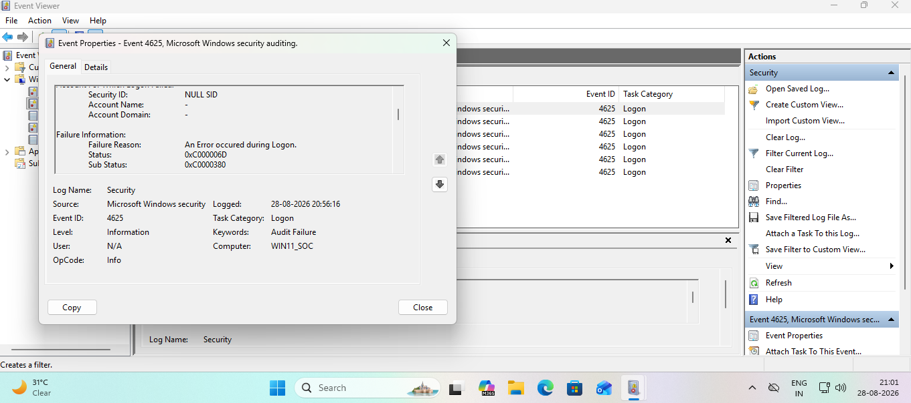
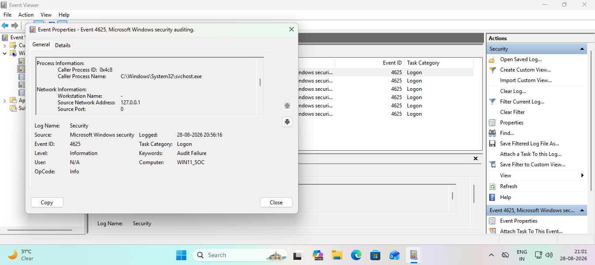
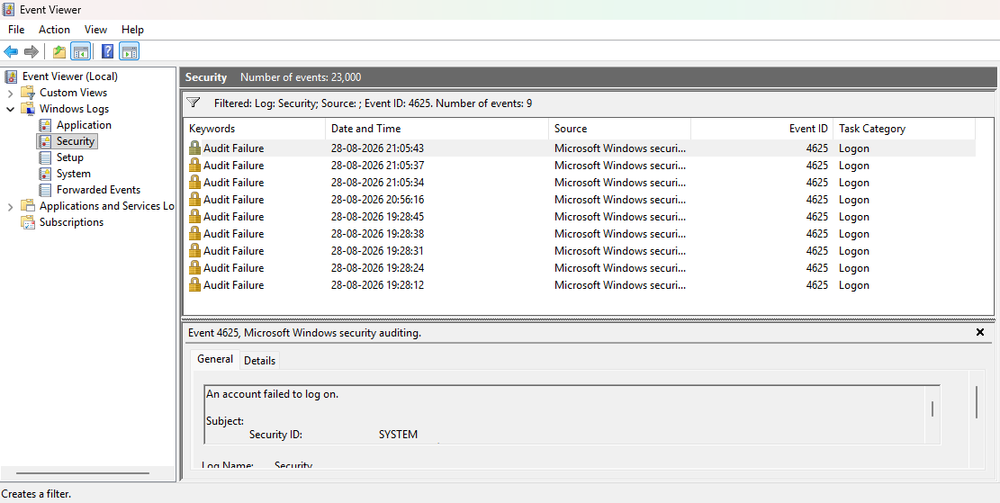
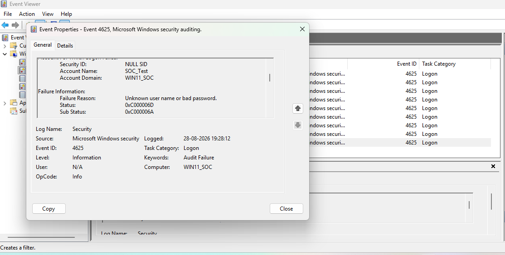
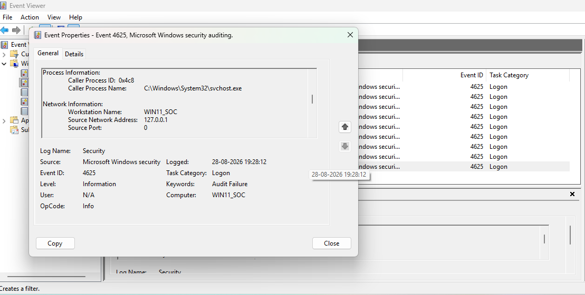
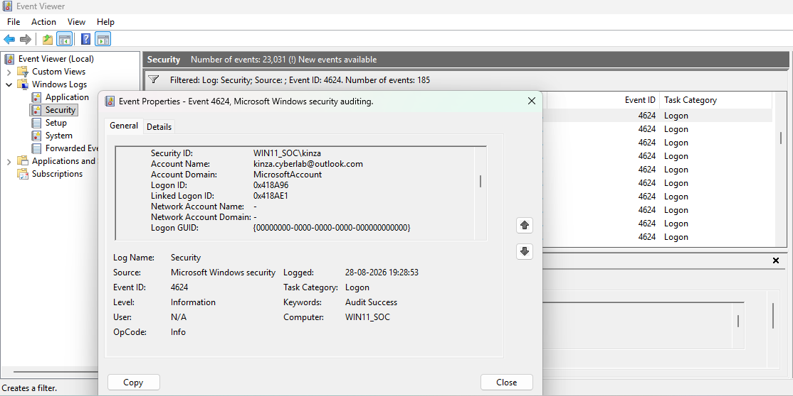
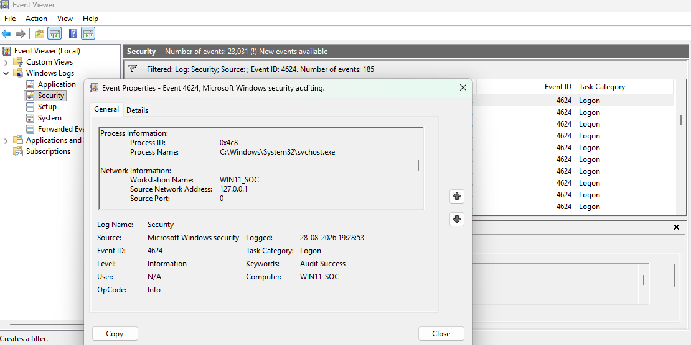
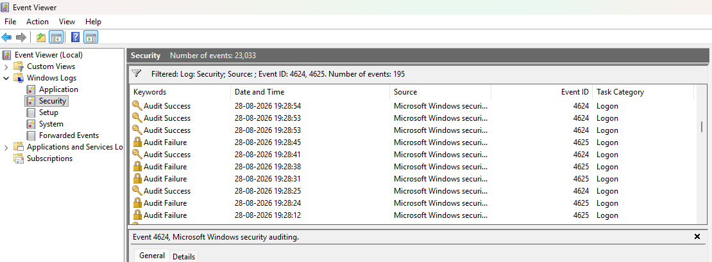

# Lab 2: Windows Failed Authentication & Brute-Force Investigation

## Objective

Investigate Windows authentication failures using Security Event Viewer and determine whether repeated failed logons indicate normal activity, suspicious behavior, or a potential brute-force pattern.

The investigation focused on:

* Event ID 4625: Failed logon
* Event ID 4624: Successful logon
* Logon Type 2: Interactive
* Authentication failure status/sub-status
* Caller process and logon process
* Source IP and localhost activity
* Repeated authentication-failure patterns
* Correlation between failed and successful authentication events

---

## Lab Environment

* **Target:** Windows 11 VM
* **Hostname:** `WIN11_SOC`
* **Primary tool:** Windows Event Viewer
* **Log:** Windows Logs → Security
* **Investigation approach:** Event analysis → Pattern recognition → Correlation → SOC assessment

---

## 1. Initial 4625 Investigation

### Event ID 4625

Event ID **4625** indicates that an account failed to log on.

The initial event showed:

| Indicator              | Observation     |
| ---------------------- | --------------- |
| Event ID               | 4625            |
| Logon Type             | 2 - Interactive |
| Target Account         | Unknown / `-`   |
| Caller Process         | `svchost.exe`   |
| Source IP              | `127.0.0.1`     |
| Logon Process          | `User32`        |
| Authentication Package | Negotiate       |
| Status                 | `0xC000006D`    |
| Source                 | Localhost       |

### Interpretation

The authentication request failed and originated from the local system.

Because the source was `127.0.0.1` and the caller was `svchost.exe`, the event could represent legitimate Windows activity rather than an external attack.

The event should therefore be investigated in context rather than immediately classified as malicious.

### Key SOC takeaway

> A single 4625 event is an indicator of failed authentication, not proof of an attack.

---

## 2. Understanding the Authentication Fields

### Caller Process vs. Logon Process

* **Caller Process:** The process that initiated/requested the authentication operation.
* **Logon Process:** The Windows authentication component/process involved in processing the logon request.

Example:

```text
Caller Process: svchost.exe
Logon Process:  User32
```

These fields provide different pieces of context and should not be treated as the same thing.

### Source IP

`127.0.0.1` is the IPv4 loopback address.

It indicates that the connection originated from the same computer rather than from another machine over the network.

### Important distinction

A localhost source does **not automatically mean benign activity**. Local malware or a compromised process can also generate activity locally.

---

## 3. Repeated 4625 Pattern Analysis

Multiple 4625 events were examined together.

Three consecutive events had effectively identical characteristics:

* Event ID: 4625
* Logon Type: 2
* Caller Process: `svchost.exe`
* Source IP: `127.0.0.1`
* Logon Process: `User32`
* Status: `0xC000006D`
* Sub-status: `0xC0000380`

The events occurred within approximately 38 seconds.

### SOC Interpretation

The repeated failures were more significant as a **pattern** than as individual events.

Possible explanations included:

* Legitimate Windows authentication activity
* User-interface authentication activity
* Automated local activity
* Potentially suspicious authentication behavior

However, these events alone were insufficient to classify the activity as brute force.

### Key SOC takeaway

> Repeated 4625s → investigate the pattern and correlate surrounding events; never label them brute force from 4625 alone.

---

## 4. Controlled Failed-Login Test

A controlled test was performed using the `SOC_Test` account.

The first failed authentication event showed:

| Indicator      | Observation                      |
| -------------- | -------------------------------- |
| Event ID       | 4625                             |
| Account        | `SOC_Test`                       |
| Account Domain | `WIN11_SOC`                      |
| Logon Type     | 2                                |
| Failure Reason | Unknown username or bad password |
| Status         | `0xC000006D`                     |
| Sub-status     | `0xC000006A`                     |
| Caller Process | `svchost.exe`                    |
| Source IP      | `127.0.0.1`                      |
| Logon Process  | `User32`                         |

Additional failed logons were generated shortly afterward.

The failures occurred at approximately:

```text
19:28:12
19:28:24
19:28:31
19:28:38
19:28:45
```

This demonstrated how repeated authentication failures appear in Windows Security logs.

---

## 5. Identifying the Failed-Login Burst

The repeated `SOC_Test` failures showed:

* Same target account
* Same source system
* Same source IP
* Same logon type
* Same caller process
* Same authentication mechanism
* Repeated failures within a short period

This represents a clear **failed-authentication burst**.

### SOC perspective

In a real environment, an analyst would investigate:

1. How many failures occurred?
2. Over what time period?
3. Which account was targeted?
4. Was the source local or remote?
5. Which process generated the activity?
6. Did a successful authentication follow?
7. Is the behavior normal for this user/system?
8. Does EDR/SIEM telemetry provide additional evidence?

---

## 6. Correlation With Successful Authentication

The Security log was searched for Event ID 4624 following the failed attempts.

Several unrelated 4624 events were observed with different logon types, including:

* Logon Type 5
* Logon Type 7
* Logon Type 11

These were not automatically treated as successful compromise of `SOC_Test`.

A successful authentication event associated with the actual Windows user was eventually identified.

### Successful 4624 Event

The event occurred at approximately:

```text
28-08-2026 19:28:53
```

Important fields:

| Indicator              | Observation                  |
| ---------------------- | ---------------------------- |
| Event ID               | 4624                         |
| Account                | `kinza.cyberlab@outlook.com` |
| Logon Type             | 11                           |
| Caller Process         | `svchost.exe`                |
| Logon Process          | `User32`                     |
| Source IP              | `127.0.0.1`                  |
| Authentication Package | Negotiate                    |
| Elevated Token         | Yes                          |

The successful event was associated with the legitimate Windows account and occurred after the failed authentication activity.

---

## 7. Windows Hello Correlation

The successful authentication used Windows Hello.

The resulting 4624 event showed **Logon Type 11**, demonstrating that a successful Windows Hello-related authentication does not necessarily appear as Logon Type 2.

This was important because authentication events must be interpreted using their complete context rather than assuming:

```text
Interactive user authentication = Logon Type 2
```

---

## 8. Final SOC Assessment

### Finding

The lab demonstrated a sequence of failed authentication events followed by successful authentication activity.

The repeated 4625 events demonstrated how a potential brute-force pattern can appear in Windows Security logs.

However, the investigation did **not** establish a real brute-force attack because the observed activity was generated in a controlled/local lab environment and the successful authentication involved the legitimate local user.

### Analyst conclusion

The correct SOC response is to identify the authentication pattern, examine the account and source, correlate surrounding events, and gather additional telemetry before assigning a malicious classification.

### Key Lessons

* **4625 = failed logon**
* **4624 = successful logon**
* Logon Type provides important context.
* Logon Type 2 does not automatically prove a human user performed the action.
* `127.0.0.1` indicates localhost activity.
* `svchost.exe` can legitimately generate authentication-related activity.
* Caller Process and Logon Process provide different information.
* Repeated 4625 events should trigger pattern analysis.
* Multiple 4625 events alone do not prove brute force.
* A successful 4624 should be correlated with preceding failures carefully.
* Windows Hello can produce a successful 4624 with Logon Type 11.
* Local activity can still be suspicious; localhost does not automatically mean benign.
* SOC analysts should avoid conclusions based on a single field or event.

---

## SOC Investigation Workflow

```text
4625 detected
      ↓
Identify account and Logon Type
      ↓
Check failure reason/status
      ↓
Identify source IP
      ↓
Examine caller/logon process
      ↓
Search surrounding 4625 events
      ↓
Identify repeated pattern
      ↓
Search for related 4624 events
      ↓
Correlate account + time + source + context
      ↓
Assess benign / suspicious / malicious
      ↓
Document findings and evidence
```

---

## Skills Demonstrated

* Windows Event Viewer
* Windows Security Event Log Analysis
* Authentication Event Investigation
* Event ID 4624 Analysis
* Event ID 4625 Analysis
* Logon Type Analysis
* Authentication Failure Analysis
* Event Correlation
* Pattern Recognition
* Brute-Force Detection Concepts
* SOC Triage and Investigation
* False-Positive Awareness
* Windows Authentication Concepts

---

## Evidence

Screenshots included in this lab demonstrate:

1. Initial 4625 failed authentication event
2. Repeated 4625 authentication failures
3. Controlled `SOC_Test` failed-login event
4. Multiple failed-login events showing the burst pattern
5. Successful 4624 event
6. 4624 showing Logon Type 11 associated with Windows Hello authentication
7. Event Viewer Security log showing the chronological relationship between events

---

## Final Takeaway

> **Failed authentication becomes interesting when it forms a pattern. A SOC analyst should correlate frequency, timing, account, source, process, and subsequent authentication activity before determining whether the behavior is malicious.**

## Screenshots

### 1. Initial 4625 Failed Authentication Event


### 1(b). Initial 4625 Failed Authentication Event - Additional Evidence


### 2. Repeated 4625 Authentication Failures


### 3. Controlled SOC_Test Failed Login


### 3(b). Controlled SOC_Test Failed Login - Additional Evidence


### 4. Failed Login Burst Pattern


### 5. Successful 4624 Authentication - Logon Type 11


### 5(b). Successful 4624 Authentication - Additional Evidence


### 6. Correlated Security Events

